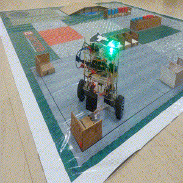

# LQR-BalanceBot
LQR-BalanceBot is a two wheel self-balancing robot, based on Arduino Mega. It uses Linear-Quadratic-Regulator, an optimal controller which optimizes a cost function using energy-based method to give optimum gains according to our requirements. A six-state variable state space model has been designed to control position, velocity, yaw (using Quadrature encoders), and tilt angle (using GY-87 sensor) of the bot.

### Video Demonstration ###
https://youtu.be/7lbDvhHPumI

### Results Snapshots

**Traversing slope**

  
  
    

**Object pick up and drop**

  
  
    

**Position hold**

  

### Contributors
Akshay S Rao, Aliasgar AV, [Ankit Kumar](https://github.com/Ankit-km), [Mohammed Rehab Sait](https://github.com/MohammedRehabS).

### Repository Contents ###
- **Libraries:** Contains MPU and I2C libraries
- **code:** Contains the code for controlling the bot
- **Model:** Contains code files for Mathematical modelling of Robot 
- **Report:** Documentation on the working of the robot and all the task submissions
- **Images:** contains images
